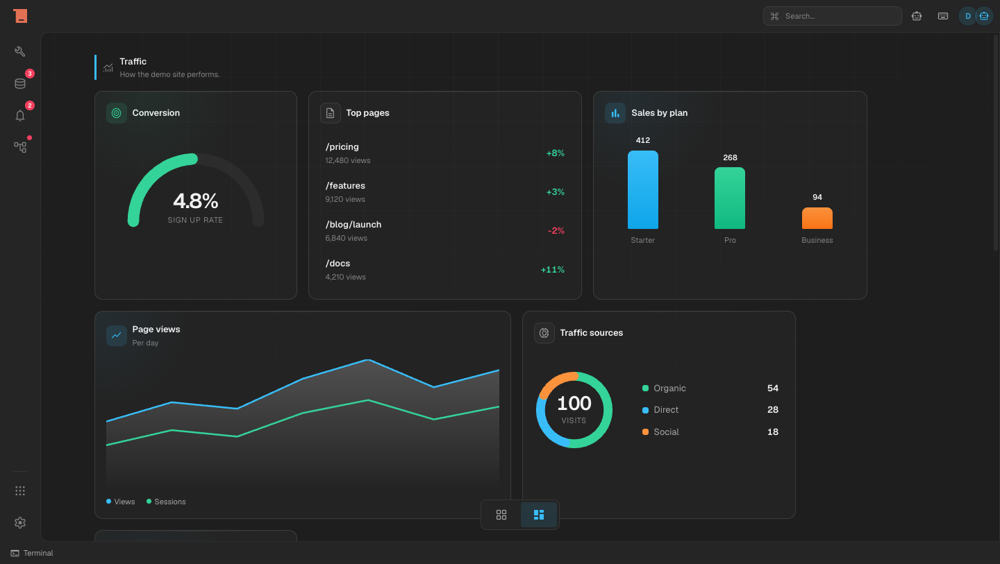

# OneType

**One Workspace. Everything Connected. Everything Yours.**

You work across twenty apps that don't know about each other. Your tasks can't see your calendar, your website builder has never met your cloud, and none of it truly belongs to you.

OneType ends that. It is an open source workspace where every application lives on one platform, shares one universal database, and speaks one language of commands. Applications don't just sit next to each other. They see each other, react to each other, and automate each other.

And because every action is a command, AI is not a chat box on the side. It drives the entire workspace, the same way you do.

## What this becomes

- Full products as installable packages: web builders, cloud infrastructure, tasks, calendars, docs, and anything the community builds
- One database and one command layer underneath everything, so every app can hook into every other app
- Automation that spans your whole workspace, not one tool at a time

## Status

OneType is in active development and moving fast. The foundation is being built in the open, right here: the framework, the kernel, the runtime and package system, and a full element library.

## Team

**[Dejan Tomić](https://www.linkedin.com/in/tomic-d/)** is the founder and the architect. Every architecture decision on this platform is his, and he writes the core with the standard he demands from everything else: no workarounds, no shortcuts, built to last. Reach him at [hi@iamdejan.com](mailto:hi@iamdejan.com) or [iamdejan.com](https://iamdejan.com).

**[Stefan Pakić](https://www.linkedin.com/in/pakic/)** is second in command. Core developer, the other half of every hard problem, and the reason the pace never drops.
